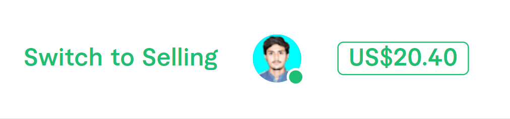
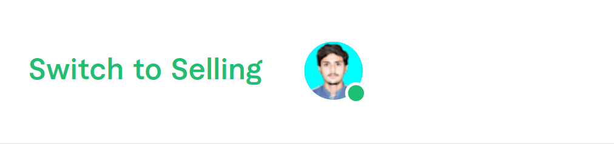

# 1. MK HideIt

 The extension hides the balance from the Fiverr page. It was built for the people who don't want their balance to be seen by other people especially when they are working in public places.

- [1. MK HideIt](#1-mk-hideit)
- [2. Demo](#2-demo)
- [3. Installation Guide](#3-installation-guide)
- [4. Author](#4-author)
- [5. License](#5-license)
- [6. Footer](#6-footer)

# 2. Demo

|             Before             |            After             |
| :----------------------------: | :--------------------------: |
|  |  |

# 3. Installation Guide
For Microsoft Edge users, just go to the [Extension at Microsoft Edge Addon](https://microsoftedge.microsoft.com/addons/detail/mk-hide-balance/pabppihjjkdnfndndmflfbickadkcglf)

# 4. Author
This extension is developed by [Muhammad Khuzaima Umair](https://www.github.com/mkhuzaima "Github Profile").

Made with :heart:

# 5. License
MIT Liscense

# 6. Footer
If you like this extension, feel free to star the repo.
